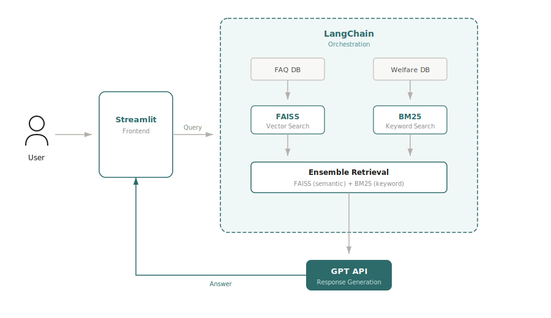

# Welfare Compass 복지나침반

A conversational AI chatbot that matches Seoul residents with relevant welfare programs through natural language dialogue.

**Hackathon result**: Top 20 / 181 teams — 2025 SeSAC AI Hackathon (Dec 1–2, 2025)

> Live demo: [welfare-compass.streamlit.app](https://welfare-compass.streamlit.app/)
> Case study: [finekiwi.github.io/welfare-compass.html](https://finekiwi.github.io/welfare-compass.html)

---

## Overview

Most welfare programs in Korea are fragmented across dozens of government portals with complex eligibility conditions. Welfare Compass lets users describe their situation in plain Korean ("27살이고 취준 중인데 월세 살아요") and returns a ranked list of matching programs — without requiring them to know what to look for.

The core challenge was structuring an unstructured conversation into filterable user data, then scoring ~100 Seoul welfare programs against that profile.

---

## Architecture




```
User message
    ↓
Intent detection (keyword-based)
    ↓
User info extraction (GPT-4o-mini → structured JSON)
    ↓
Matching engine (filter + priority scoring)
    ↓
Response generation (GPT-4o-mini, mode-aware prompt)
    ↓
Welfare cards (Streamlit UI)
```

**RAG for FAQ**: FAQ questions are embedded with `text-embedding-3-small` and stored in a FAISS index via LangChain. When intent is classified as `faq`, the top-k matching Q&A pairs are injected into the response prompt as context.

**Matching logic**: Programs are filtered by age, employment status, residence, and special conditions (신혼부부, 한부모, 장애인, etc.), then scored by category relevance, housing type match, income level, and keyword signals. Returns top 10 with category diversity.

**Conversation modes**: `match` → `detail` → `apply` / `eligibility` / `faq` — each mode has a distinct system prompt injected at runtime.

---

## Tech Stack

| Layer | Stack |
|---|---|
| UI | Streamlit |
| LLM | OpenAI GPT-4o-mini |
| Embeddings | OpenAI text-embedding-3-small |
| Orchestration | LangChain |
| Vector search | FAISS |
| Data | pandas, CSV |
| Language | Python 3.10 |

---

## How to Run

**1. Clone and install**

```bash
git clone https://github.com/finekiwi/welfare-compass.git
cd welfare-compass
pip install -r requirements.txt
```

**2. Set up environment**

Create a `.env` file in the project root:

```
OPENAI_API_KEY=sk-...
```

**3. Build the FAQ index** (one-time setup)

```bash
python services/faq.py
```

This reads `data/faq.csv`, generates embeddings, and saves a FAISS index to `faiss_index/`.

**4. Run the app**

```bash
streamlit run app.py
```

---

## Project Structure

```
welfare-compass/
├── app.py                  # Streamlit app entry point
├── config.py               # Constants, keywords, model settings
├── services/
│   ├── llm.py              # OpenAI calls (extraction + response generation)
│   ├── matching.py         # Welfare program matching algorithm
│   └── faq.py              # FAQ RAG module (FAISS)
├── utils/
│   ├── data_loader.py      # CSV loading with Streamlit cache
│   ├── income_calculator.py# 2025 median income calculations
│   ├── intent_detector.py  # Intent classification
│   ├── region_checker.py   # Seoul region validation
│   └── user_needs.py       # Category extraction from user needs
├── ui/
│   ├── welfare_card.py     # Welfare program card component
│   ├── sidebar.py          # User info display
│   └── styles.py           # Custom CSS
├── data/
│   ├── welfare_data.csv    # ~100 Seoul welfare programs
│   └── faq.csv             # FAQ knowledge base
└── faq/                    # Source PDF documents
```

---

## Limitations & Future Work

**Current limitations (MVP scope):**
- Data is manually curated (~100 programs) — not synced with live government APIs
- Income eligibility filtering is approximate; exact bracket matching requires more granular data
- No user authentication or session persistence
- FAQ RAG works only for programs covered in `faq.csv`
- Seoul-only; other regions return a redirect message

**What I'd do differently with more time:**
- Replace manual CSV with a pipeline pulling from the 온통청년 API
- Add a proper income bracket filter using the full 기준중위소득 table
- Move matching logic to a more structured scoring framework (currently heuristic)
- Add evaluation: measure intent classification accuracy and matching precision

---

## Context

This repository contains the MVP codebase built over 2 days at the 2025 SeSAC AI Hackathon (Dec 1–2). Not production-ready, but functional end-to-end.

- During the hackathon, a teammate contributed ensemble retrieval improvements for the final submission
- The project is now being developed into a full web service (Welfare Compass v2) as a separate three-person project — adding a React frontend, Django backend, user authentication, and migrating to a LangGraph ReAct agent architecture
